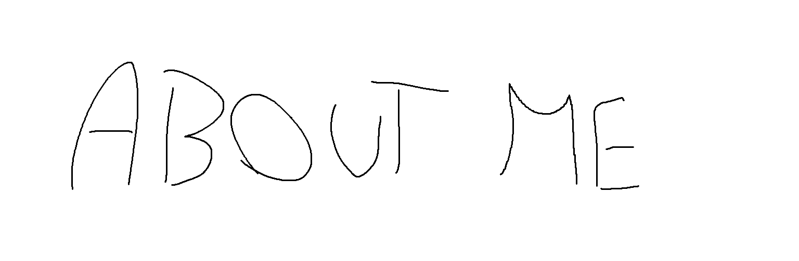

<p align="center">
  
</p>

<h1 align="center">domiciliation / Benew 👋</h1>

<p align="center">
  versatile developer • C++ focused • creative
</p>
<p align="center">
  
  
  
  
</p>

<p align="center">
  
</p>

---

### 🧠 Profile

I’m a developer who works on a wide range of projects, with a strong focus on **C++**.

I enjoy building systems, understanding how things work internally, and pushing performance when needed.

- Strong in **C++** (including advanced use cases)
- Python & Lua for tools and scripting  
- FiveM development (custom systems & scripts)  
- Comfortable with **Photoshop** & **After Effects**

---

### ⚙️ What I Do

- Build custom scripts and tools  
- Develop C++ projects (performance & logic)  
- Work on FiveM systems  
- Create automation scripts in Python  
- Do visual/motion design when needed  

---

### 🧰 Stack

```txt
Languages  : C++ / Python / Lua
Development: FiveM / tools / systems
Creative   : Photoshop / After Effects
Tools      : Git / VS Code
```
<p align="center"> <i>build, break, learn, repeat</i> </p> <p align="center"> 🤝 free for collaboration </p>
